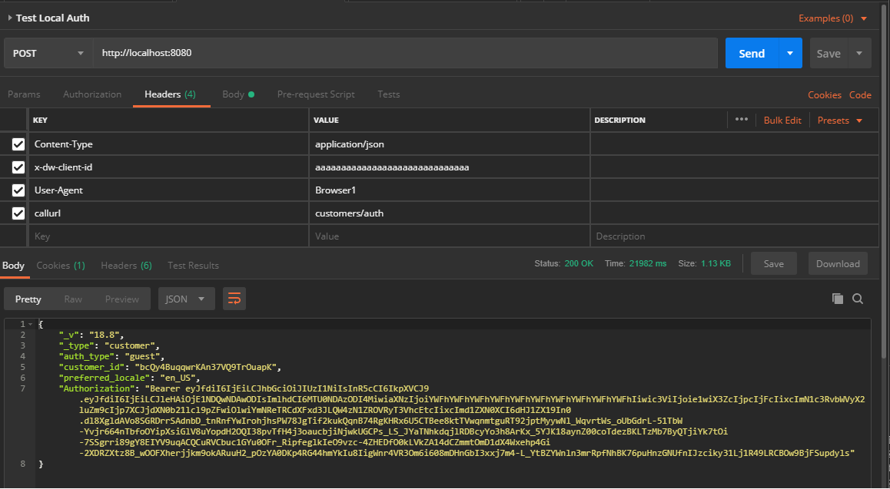

# Salesforce Commerce Cloud OCAPI Interceptor 


This project will serve as a SFCC Cartridge that requests can be made to in  an SFCC instance instead of accessing OCAPI directly.

One may use this proxy to be middleware to seperate calls being made from a mobile app (ajax for instance) 

Coresponding Cordova/PhoneGap App Template: https://github.com/johnfacey/sfcc-cordova-ocapi

## Getting Started

Configure the OCAPI BM Settings
More Documentation to follow

## Prerequisites
```
Required:
    SFCC Instance - Configured for OCAPI

Optional:
    Postman or another rest API tool.
```
## Installing
```
load the int_ocapi_intercept to version and adjust the Site path
```

## Running 

Testing with postman: 
```
Instructions to follow
```

## OCAPI Commands

You can send OCAPI commands to your local proxy. 
Specify the host to make the call.
Send the endpoint as the **callurl** header attribute.
All other attributes can be sent similar to a direct OCAPI call. 
This ensures that the Proxy communicates with OCAPI as middleware.

## Postman Suite
[Postman Collection](./examples/OCAPI-Proxy.postman_collection.json)

Example: 



## Deployment/Development

This is currently a work in progress. Please report any issues you find.
Latest: Fixes to logging added dates to log files.
Updated contact info for [Github](https://github.com/johnfacey) and [Twitter](https://twitter.com/johnfacey).

## OCAPI Output Modifications

Currently **Authorization** and **ETag**  headers are returned into the body from the output proxy rather than in the header. These are not needed in 19.X

## Authors

* **John Facey II** - *Lead Developer*  
[](https://github.com/johnfacey)
[](https://twitter.com/johnfacey)


## License

[](https://opensource.org/licenses/MIT)

See the [LICENSE.md](LICENSE.md) file for details

## Acknowledgments

* [**Salesforce Commerce Cloud**](https://www.salesforce.com/products/commerce-cloud/overview)
* [**Visual Studio Code**](https://code.visualstudio.com)
* [**ngrok**](https://ngrok.com)